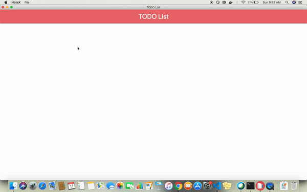

# NoteX

NoteX is a desktop application. The purpose of this applicattion to maintain todo list. It is developed using Electron JS.


#### Run Application in Developer mode

```
npm start
```

#### Generate Package
##### Mac
```
npm run package-mac
```
##### Linux
```
npm run package-linux
```
##### Windows
```
npm run package-win
```

### Planned features
1. **Add new note:** When new note is added, it will be added sidebar. There can be multiple notes in sidebar. The purpose of this feature is to maintain group similar TODO in a single note.
Ex: There can be a note for to list of item to be purchaged. Another note may contains list books to read etc.
2. **Data storage:** Currently, todo list items are being stored in memory. When application is refreshed/reopened, previously added data will be vanished. We have not finalized that where data will be store: it can be database, file system.
3. **Package Installer:** This application support command to generate package for Windows, Linux and Mac but we have not created installer yet. We want to create a installer which will be easily downloaded and installed.
4. **Mark task as done:** There should be checkbox in front of each task. When checkbox will be check that task will be considered as done and it move to end of list. If it is unchecked again, it will be move to top of the list. This should be done by some animated way(Good to have).
5. **Delete task:** Currently, a task can be delete by double clicking the task but it is not a user friendly way of deleting a task. If some is new to the application will not know about this feature or someone might double-click on the task to select it(some people have habbit of double-clicking on each text). To make it more user friendly feature, we should a `X` at the end of the task. When user will click on the `X`, the task will be deleted.

